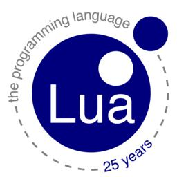

# lua-book

Lua脚本学习
===========

Lua 是一个小巧的脚本语言。  

是巴西里约热内卢天主教大学（Pontifical Catholic University of Rio de Janeiro）里的一个研究小组，由Roberto Ierusalimschy、Waldemar Celes 和 Luiz Henrique de Figueiredo所组成并于1993年开发。其设计目的是为了嵌入应用程序中，从而为应用程序提供灵活的扩展和定制功能。   

Lua 有一个同时进行的JIT项目，提供在特定平台上的即时编译功能。

Lua脚本可以很容易的被C/C++ 代码调用，也可以反过来调用C/C++的函数，这使得Lua在应用程序中可以被广泛应用。不仅仅作为扩展脚本，也可以作为普通的配置文件，代替XML,ini等文件格式，并且更容易理解和维护。 

Lua由标准C编写而成，代码简洁优美，几乎在所有操作系统和平台上都可以编译，运行。一个完整的Lua解释器不过200k，在目前所有脚本引擎中，Lua的速度是最快的。这一切都决定了Lua是作为嵌入式脚本的最佳选择。

点击右上角的 **[Watch](https://github.com/52fhy/lua-book/subscription)** 订阅本书，点击 Star 收藏本书。

- [issue](https://github.com/52fhy/lua-book/issues)

## 目录

- [01- Lua脚本学习--入门](chapter1.md)
- [02- Lua脚本学习--数据类型](chapter2.md)
- [03- Lua脚本学习--运算符](chapter3.md)
- [04- Lua脚本学习--控制语句](chapter4.md)
- [05- Lua脚本学习--函数](chapter5.md)
- [06- Lua脚本学习--模块](chapter6.md)
- [07- Lua脚本学习--常用库介绍](chapter7.md)
- [08- Lua脚本学习--文件操作](chapter8.md)
- [09- Lua脚本学习--元表](chapter9.md)
- [10- Lua脚本学习--面向对象编程](chapter10.md)
- [11- Lua脚本学习--Redis里使用Lua](chapter11.md)
- [12- Lua脚本学习--Ngx_lua](chapter12.md)

[开始阅读：Lua脚本学习--入门](chapter1.md)

## 打赏作者

欢迎微信扫码打赏我，感谢支持！

